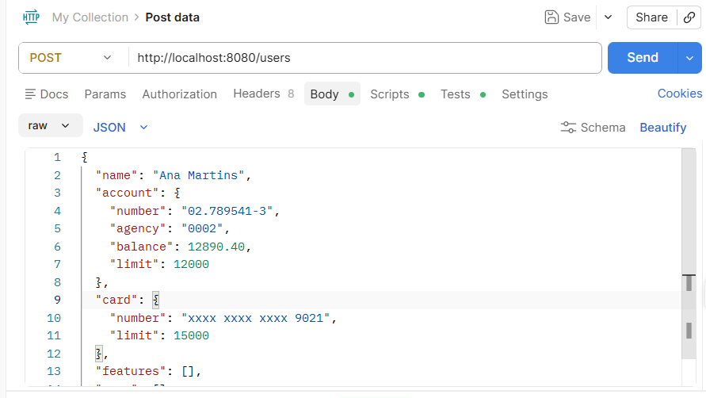
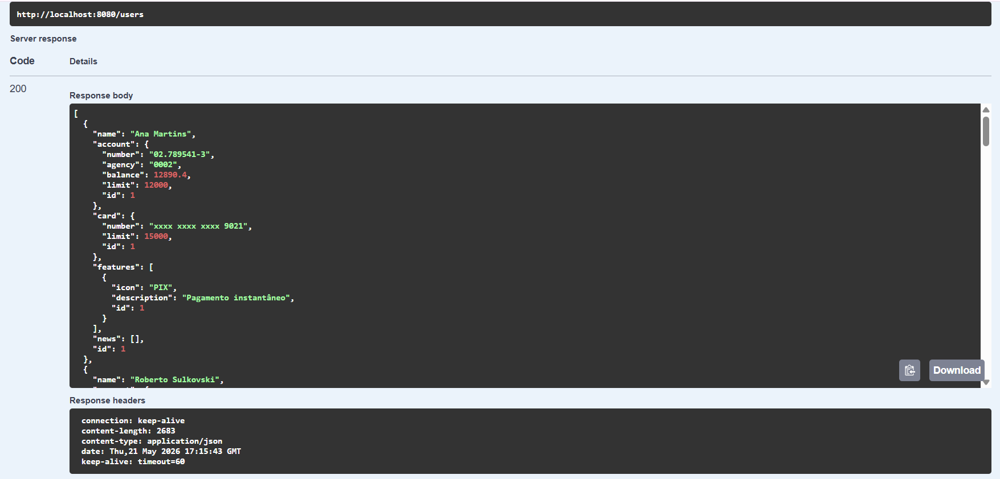
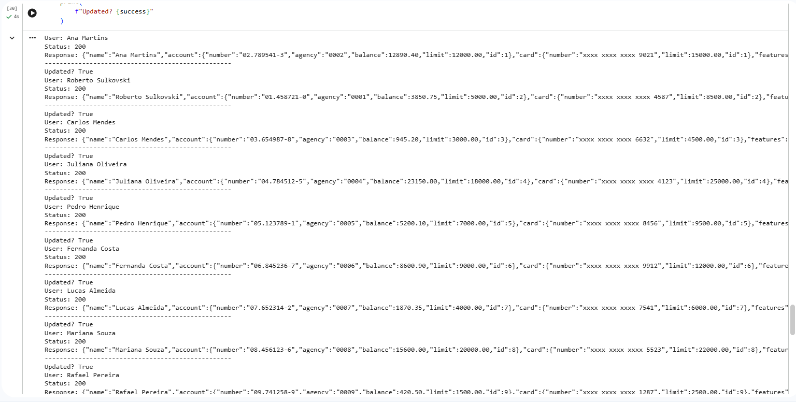
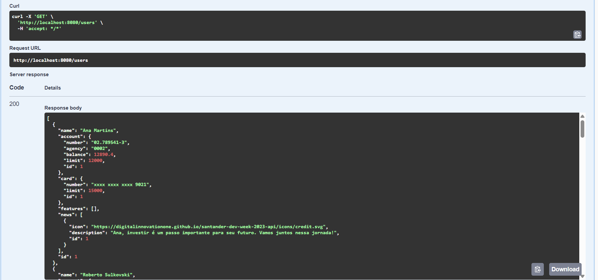

# Santander Dev Week 2023 ETL

ETL pipeline developed during Santander Dev Week using Python, OpenAI API and a custom Spring Boot banking API for personalized banking campaign generation.

---

## Technologies

- Python
- Pandas
- OpenAI API
- Spring Boot
- Java
- H2 Database
- Swagger
- Postman
- Google Colab
- Ngrok
- Git & GitHub

---

## ETL Flow

1. Extract users from a custom Spring Boot API
2. Transform data with OpenAI-generated personalized messages
3. Load updated data back into the API
4. Export the final processed dataset to CSV

---

## Project Structure

```text
santander-dev-week-2023-etl/
│
├── assets/
│   ├── colab.png
│   ├── postman-create-user.png
│   ├── swagger-before-openai.png
│   └── swagger-after-openai.png
│
├── data/
│   └── SDW2023.csv
│
├── output/
│   └── resultado_usuarios_ia.csv
│
├── SantanderDevWeek2023.ipynb
│
└── README.md
```

---

## Creating Users via Postman

Users were manually inserted into the Spring Boot API through Postman before the ETL execution.



---

## API Before AI Processing

Users stored in the API before OpenAI message generation.



---

## OpenAI ETL Execution

Google Colab notebook executing the ETL pipeline and updating users through HTTP PUT requests.



---

## API After AI Processing

Users updated with personalized financial messages generated by OpenAI.



---

## Dataset

Input dataset:

```text
data/SDW2023.csv
```

Output dataset:

```text
output/resultado_usuarios_ia.csv
```

---

## Features

- REST API integration with Spring Boot
- OpenAI-generated personalized banking messages
- ETL pipeline execution in Google Colab
- CSV input/output processing
- HTTP requests with Python
- Data persistence using H2 Database
- API documentation with Swagger

---

## Author

Roberto Sulkovski

GitHub:

- :contentReference[oaicite:0]{index=0}
- :contentReference[oaicite:1]{index=1}
